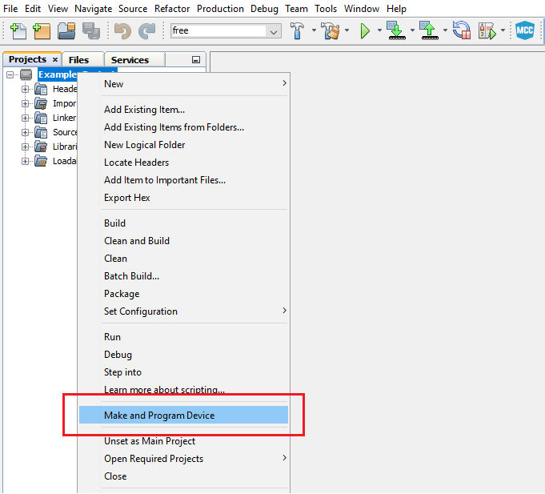

<!-- Please do not change this logo with link -->

# AVR128DA48 Driving a Metronome

This repository provides an MPLAB® X project with an MCC generated code example for driving a metronome.
 The application consists of a circuit composed of Core Independent Peripherals (CIPs), which is capable of creating the signals that drive the Switec stepper motor as a metronome. It also adjusts the number of beats per minute of the metronome by reading an input value provided by the user.
 When the application starts, the shaft of the motor is set to an initial position, so that the oscillation always starts from a fixed position and is symmetrical to the center of the dial.
The metronome begins oscillating with a specific frequency and to modify it, the user can adjust the position of a potentiometer, which is connected to the microcontroller. Whenever a period is completed, the metronome produces an audible and visual signal through an LED and a buzzer.
 The CIPs used are:
- Timer/Counter Type D (TCD0)
- Timer/Counter Type A (TCA1)
- Timer/Counter Type B (TCB0)
- Configurable Custom Logic (CCL)
- Event System (EVSYS)
- Analog-to-Digital Converter (ADC)
- Voltage Reference (VREF)

## Related Documentation
 More details and code examples on the AVR128DA48 can be found at the following links:
 - [AVR128DA48 Product Page](https://www.microchip.com/wwwproducts/en/AVR128DA28)
 - [AVR128DA48 Code Examples on GitHub](https://github.com/microchip-pic-avr-examples?q=avr128da48)
 - [AVR128DA48 Project Examples in START](https://start.atmel.com/#examples/AVR128DA48CuriosityNano)
 - [Switec Stepper Documentation](https://guy.carpenter.id.au/gaugette/resources/switec/X25_xxx_01_SP_E-1.pdf)

## Software Used
 - MPLAB® X IDE 5.40 or newer [(microchip.com/mplab/mplab-x-ide)](http://www.microchip.com/mplab/mplab-x-ide)
 - MPLAB® XC8 2.30 or a newer compiler [(microchip.com/mplab/compilers)](http://www.microchip.com/mplab/compilers)
 - MPLAB® Code Configurator (MCC) 4.0.1 or newer [(microchip.com/mplab/mplab-code-configurator)](https://www.microchip.com/mplab/mplab-code-configurator)
 - MPLAB® Code Configurator (MCC) Device Libraries 8-bit AVR MCUs 2.5.0 or newer [(microchip.com/mplab/mplab-code-configurator)](https://www.microchip.com/mplab/mplab-code-configurator)
 - AVR Dx 1.6.88 or newer Device Pack

## Hardware Used
 - AVR128DA48 Curiosity Nano [(DM164151)](https://www.microchip.com/Developmenttools/ProductDetails/DM164151)
 - Switec Stepper motor
 - Potentiometer
 - LED
 - Buzzer
 - Wires

## Setup
 The AVR128DA48 Curiosity Nano Development Board is used as test platform.

  

 The following configurations must be made for this project:

System clock: 4MHz (default)

TCD0:
- Enable TCD check box: Checked
- Clock Selection: Internal High-Frequency Oscillator
- Counter Prescaler: Sync clock divided by 4
- Synchronization Prescaler: Selected Clock Source divided by 2
- Compare B Clear: 5 ms
- Compare B Set: 2.5 us
- Compare B Value: Enabled
- Compare B Enable: Enabled

TCA1:
- Enable Timer check box: Checked
- Clock Selection: System Clock
- Timer Mode: 16 bit (Normal)
- Requested Timeout: 16.384 ms
- Enable Overflow Interrupt check box: Checked
- Waveform Generation Mode: Normal mode
- Compare channel 1: Enabled
- Compare channel 1 Requested Timeout: 0s
- Compare channel 1 Output Value: Enabled
- Enable Counter Event Input A: Enabled
- Channel 1 compare match interrupt: Enabled

TCB0:
- Enable TCB check box: Checked
- Clock Select: Count on event edge
- Timer Mode: 8-bit PWM
- Enable Event Input Capture check box: Checked
- Enable Pin Output check box: Checked
- Compare register: 0x60B

LUT0:
- Enable LUT check box: Checked
- IN0: LINK
- IN1: MASK
- IN2: EVENTA
-	Enable LUT-OUT check box: Checked
- Filter Option: SYNCH
- Clock Selection: IN2
- TRUTH register: 0x01

LUT1:
- Enable LUT check box: Checked
- IN0: TCB0
- IN1: TCA1
- IN2: EVENTA
-	Enable LUT-OUT check box: Checked
- Filter Option: DISABLE
- Clock Selection: CLKPER
- TRUTH register: 0xE2

LUT2:
- Enable LUT check box: Checked
- IN0: LINK
- IN1: MASK
- IN2: EVENTA
-	Enable LUT-OUT check box: Checked
- Filter Option: SYNCH
- Clock Selection: IN2
- TRUTH register: 0x01

LUT3:
- Enable LUT check box: Checked
- IN0: TCB0
- IN1: EVENTA
- IN2: EVENTB
-	Enable LUT-OUT check box: Checked
- Filter Option: DISABLE
- Clock Selection: CLKPER
- TRUTH register: 0xB8

LUT4
- Enable LUT check box: Checked
- IN0: IN0
- IN1: TCA1
- IN2: IN2
-	Enable LUT-OUT check box: Checked
- Filter Option: DISABLE
- Clock Selection: CLKPER
- TRUTH register: 0xAC

EVSYS:
- Event generators:
  - TCD0_CPMBSET: CHANNEL0
  - CCL_LUT0: CHANNEL1
  - CCL_LUT2: CHANNEL2
  - CCL_LUT4: CHANNEL3
- Event users:
  - CHANNEL0: CCLLUT0A, CCLLUT2A, TCB0COUNT, TCA1CNTA
  - CHANNEL1: CCLLUT3A
  - CHANNEL2: CCLLUT1A
  - CHANNEL3: CCLLUT3B

ADC
 - Enable ADC check box: Checked
 - Result Selection: 12-bit Mode
 - Differential Mode Conversion: Disabled
 - Left Adjust Result check box: Checked
 - Sampling frequency (Hz): 140000
 - Sample Accumulation Number: 32 results accumulated

VREF
 - Enable Force ADC Voltage Reference check box: Checked
 - ADC Voltage Reference: VDD as reference

 |Pin                   | Configuration      |
 | :--------------:     | :----------------: |
 |PA0 (LED_BUZZER)      | Digital Output     |
 |PA2 (TCB0_WO0)        | Digital Output     |
 |PA3 (LUT0_OUT)        | Digital Output     |
 |PA5 (TCD_WOB)         | Digital Output     |
 |PB0 (LUT4_IN0)        | Digital Input      |
 |PB2 (LUT4_IN2)        | Digital Input      |
 |PB3 (LUT4_OUT)        | Digital Output     |
 |PD0 (ADC0_AIN0)       | Analog Input       |
 |PD3 (LUT2_OUT)        | Digital Output     |

 **Note:** Only PA0, PA2, PA3, PB0, PB2, PD0, and PD3 are actually needed for the application. The rest of the pins can be used to observe the intermediary waveforms.

 The block diagram of the system is shown in the following figure:
  

## Operation
 1. Connect the board to the PC.

 2. Open the avr128da48-cnano-metronome-mplab-mcc.X project in MPLAB X IDE.

 3. Set the avr128da48-cnano-metronome-mplab-mcc.X project as main project. Right click on the project in the **Projects** tab and click **Set as Main Project**.
  

 4. Clean and build the avr128da48-cnano-metronome-mplab-mcc.X project: Right click on the **avr128da48-cnano-metronome-mplab-mcc.X** project and select **Clean and Build**.
  

 5. Select the **AVR128DA28 Curiosity Nano** in the Connected Hardware Tool section of the project settings:
   - Right click on the project and click **Properties**
   - Click on the arrow right next to Connected Hardware Tool
   - Select the AVR128DA28 Curiosity Nano (click on the **SN**), click **Apply** and then click **OK**:

   

 6. Program the project to the board: Right click on the project and click **Make and Program Device**.
 

 Demo:
 
 **Note**: The figure above presents the waveforms that drive the contacts of the motor (TCB0_WO, LUT0_OUT and LUT2_OUT) for clockwise movement (when TCA1_WO1 is high) and for counterclockwise movement (when TCA1_WO1 is low).  

## Summary
 The demo shows how to generate the waveforms that drive a Switec Stepper motor as a metronome using Core Independent Peripherals (CIPs).
